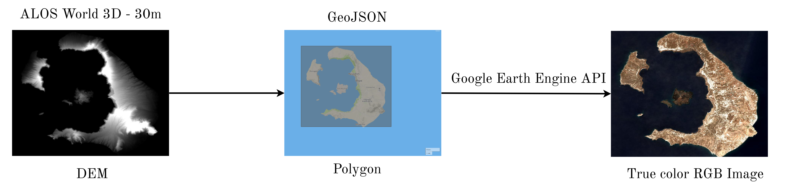
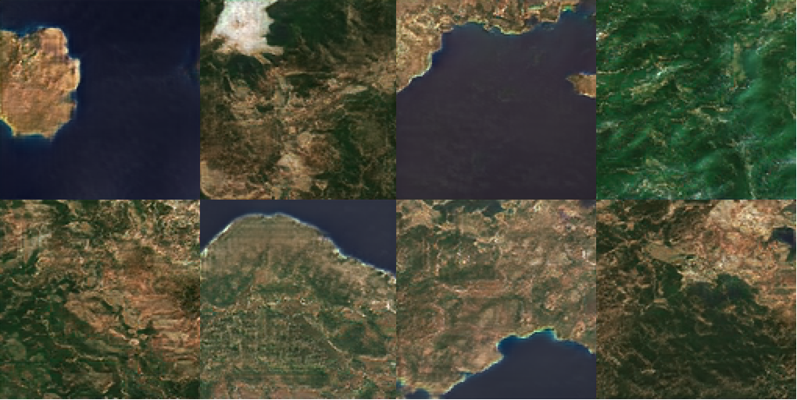
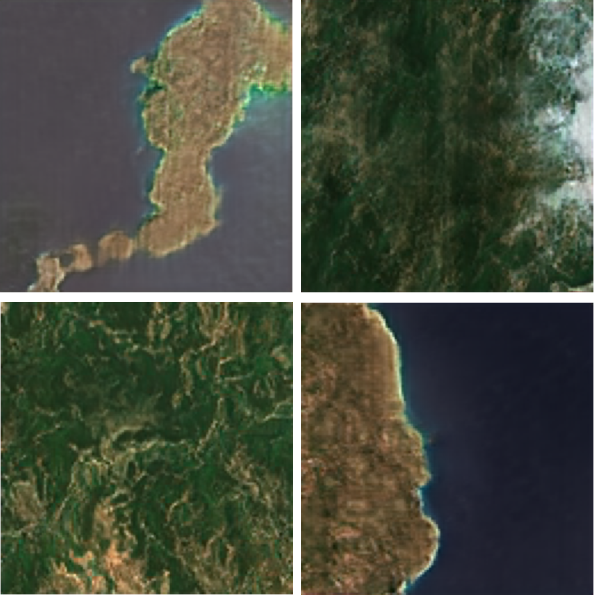
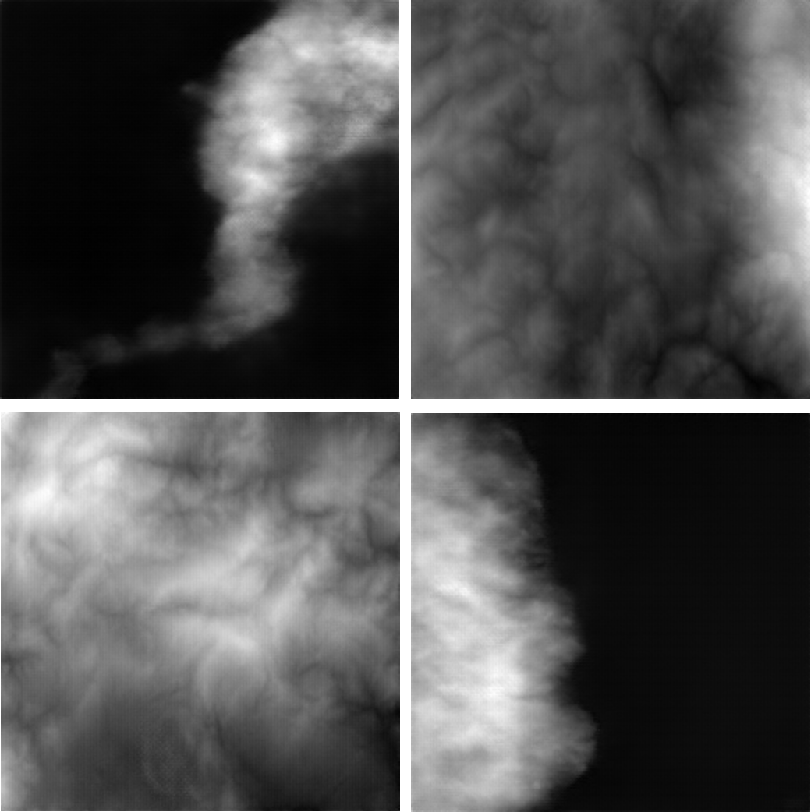
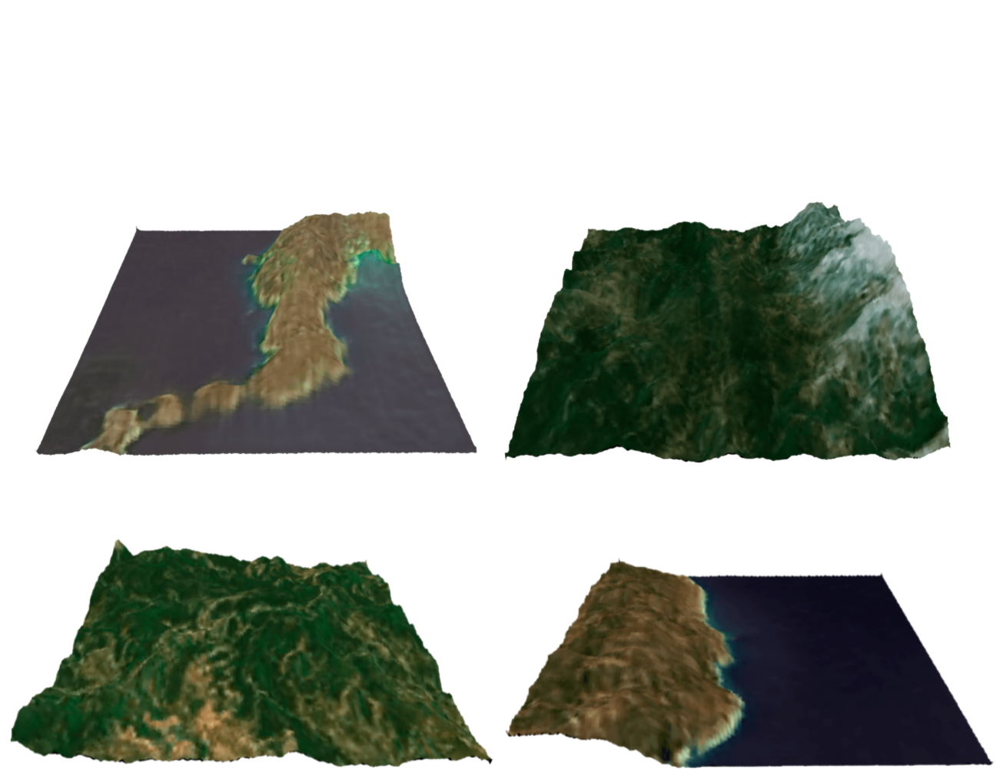

# Procedural3DTerrain
Procedural 3D Terrain Generation using Generative Adversarial Networks (GANs)

A proposed method for generating random 3D lanscapes, imitating real data of satellite images and their respective Digital Elevation Models.

To generate random satellite images a GAN architecture called ProGAN was used following a great implementation of the paper titled "Progressive growing of GANs for improved Quality, Stability, and Variation" ([https://arxiv.org/abs/1710.10196](https://arxiv.org/abs/1710.10196)) that can be found [here](https://github.com/akanimax/pro_gan_pytorch).

For extracting a 3D mesh for the randomly generated satellite images, a CGAN architecture introduced in our previous work "Generating Elevation Surface from a Single RGB Remotely Sensed Image Using Deep Learning" ( [paper](https://www.mdpi.com/2072-4292/12/12/2002), [full code](https://github.com/Panagiotou/ImageToDEM)) was used.

# Dataset

Our python script that downloads an RGB satellite image corresponding to a DEM (or GeoJSON geometry) can be found [here](https://github.com/Panagiotou/ImageToDEM/Visualization/DEM2rgb.py).

# Results

Samples of random outputs generated by the ProGAN

| Random Images (ProGAN)| Predicted DEM (CGAN) |3D  Visualization
|---|---|------|
||| 
